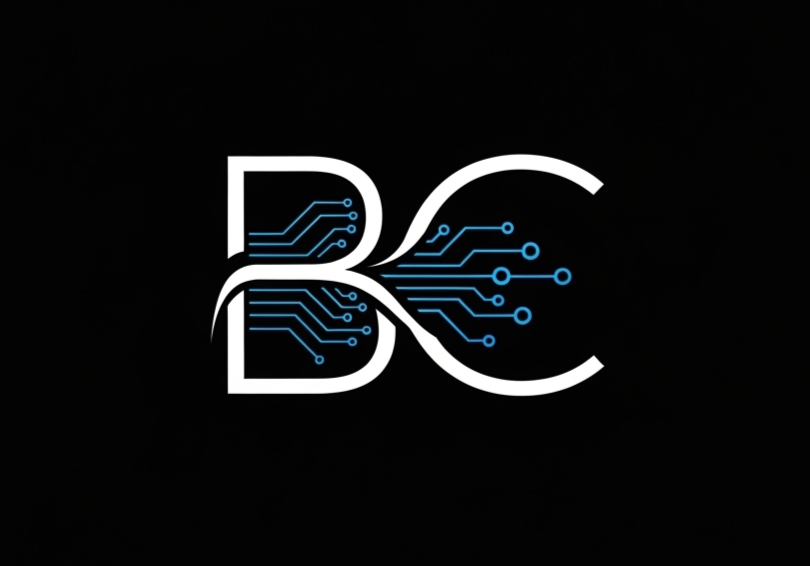

<div align="center">



<br /><br />

# BuildCode

**Plataforma SaaS de arquitetura de software potencializada por IA - Astro SSR + React + Supabase + 9 LLMs**

<br />

[](https://www.thebuildcode.com.br)
[]()
[](#licenca)

<br />

https://github.com/user-attachments/assets/b128e015-2b0a-4085-bcd6-81168f4c28d1

<br />

</div>

---

## Sobre

BuildCode e um SaaS que gera documentos de arquitetura (PRD) e Prompt Base otimizados para projetos de software, alimentado por 9 modelos de IA, dados em tempo real da GitHub API e uma base proprietaria de 200+ tecnologias.

O sistema conduz o usuario por um wizard inteligente de 20 etapas cobrindo stack completa - frontend, backend, banco de dados, autenticacao, testes, CI/CD, deploy - e entrega:

- **PRD Completo** - Justificativas tecnicas, diagrama de arquitetura, estimativa de custos
- **Prompt Base Otimizado** - Pronto para Claude, GPT, Gemini com boas praticas por tecnologia
- **Insights Visuais** - Graficos radar, distribuicao de stack, complexidade e risco

---

## Tecnologias & Stack

<div align="center">


</div>

### Framework & Runtime

| Tecnologia | Descricao |
|:---|:---|
| **Astro v5** | Framework web com SSR (Server-Side Rendering) e sistema de islands para hidratacao parcial |
| **React 19** | Biblioteca de UI para componentes interativos renderizados como Astro islands |
| **Node.js** | Runtime JavaScript server-side para as API routes do Astro |
| **Vite** | Bundler e dev server com HMR (Hot Module Replacement) ultra-rapido |
| **TypeScript** | Superset tipado de JavaScript usado em todo o codebase |

### Estilizacao & UI

| Tecnologia | Descricao |
|:---|:---|
| **Tailwind CSS v4** | Framework CSS utility-first com suporte a dark/light mode e CSS layers |
| **Framer Motion** | Biblioteca de animacoes declarativas para React - transicoes, gestos e layout animations |
| **Lucide React** | Conjunto de icones SVG otimizados e customizaveis para React |
| **Three.js** | Biblioteca 3D WebGL - usada para cena de particulas animadas no background |

### Graficos & Visualizacao

| Tecnologia | Descricao |
|:---|:---|
| **Recharts** | Biblioteca de graficos React baseada em D3 - radar, barra, area, pie charts |

### Backend & Banco de Dados

| Tecnologia | Descricao |
|:---|:---|
| **Supabase** | Plataforma BaaS (Backend as a Service) open-source baseada em PostgreSQL |
| **Supabase Auth** | Sistema de autenticacao com JWT, login/registro, sessoes e controle de acesso por roles |
| **Supabase Database** | PostgreSQL gerenciado com Row Level Security (RLS) para isolamento de dados |
| **Supabase Storage** | Armazenamento de arquivos e imagens com upload direto do client |
| **Supabase Realtime** | Subscriptions em tempo real para atualizacoes automaticas na UI |
| **PostgreSQL** | Banco de dados relacional robusto - base do Supabase |

### Integracoes de IA - 9 Modelos, 3 Provedores

| Provedor | Modelos |
|:---|:---|
| **OpenAI** | GPT-4o, GPT-4o-mini |
| **Google** | Gemini 2.0 Flash, Gemini 1.5 Pro |
| **OpenRouter** | Claude Sonnet, Claude Haiku, Llama 3.3 70B, Mistral Small, DeepSeek V3 |

**Tiers de modelo:**

```
Budget  → Gemini Flash, Llama 3.3 70B, Mistral Small       (rapido, economico)
Mid     → GPT-4o-mini, Claude Haiku, DeepSeek V3            (equilibrio custo/qualidade)
Pro     → GPT-4o, Claude Sonnet, Gemini 1.5 Pro             (maximo detalhe)
```

### APIs & Servicos Externos

| Servico | Funcao |
|:---|:---|
| **OpenAI API** | Chat com agentes de IA e geracao de PRD/Prompt |
| **OpenAI TTS** | Sintese de voz (Text-to-Speech) com 4 vozes distintas por agente |
| **Google Gemini API** | Geracao de conteudo via modelos Gemini |
| **OpenRouter API** | Roteamento unificado para Claude, Llama, Mistral e DeepSeek |
| **GitHub REST API** | Dados em tempo real - stars, forks, issues, commits, linguagens |
| **Asaas** | Gateway de pagamentos brasileiro - assinaturas e cobrancas recorrentes |

---

## Sistema de Agentes IA

4 agentes especializados com personalidade, estilo de comunicacao e voz TTS unica:

| Agente | Especialidade |
|:---|:---|
| **The Boss** | Arquitetura e decisoes estrategicas de alto nivel |
| **Azrael** | Performance, seguranca e otimizacao |
| **Rizler** | Frontend, UX e tendencias emergentes |
| **Anastasia** | Boas praticas e aprendizado guiado |

Cada agente possui voz propria via OpenAI TTS e e acessivel por chat flutuante integrado ao wizard.

---

## Funcionalidades

| Feature | Stack Envolvida |
|:---|:---|
| **Wizard de Arquitetura (20 etapas)** | Astro, React, Framer Motion - filtragem dinamica por tipo de projeto |
| **Geracao de PRD por IA** | OpenAI, Gemini, OpenRouter - selecao de modelo por tier |
| **Geracao de Prompt Base** | Multi-LLM - boas praticas por tecnologia, clean code, responsividade |
| **Chat IA com Agentes** | OpenAI GPT-4o-mini - 4 agentes com personalidade |
| **Audio TTS em tempo real** | OpenAI TTS - vozes unicas por agente |
| **Analytics Dashboard** | GitHub API, Recharts - comparacao de tecnologias lado-a-lado |
| **Painel Administrativo** | Supabase - metricas SaaS (MRR, Churn, ARPU, LTV) |
| **Biblioteca de 200+ Tecnologias** | 9 categorias: frontend, backend, dados, infra, libs, devex, IA, design, MCP |
| **Sistema de Planos** | 3 tiers com limites diferenciados e validacao server-side |
| **Perfil com Avatar** | Supabase Auth + Storage - upload e preview |
| **Internacionalizacao (i18n)** | 350+ chaves PT-BR e EN com troca instantanea |
| **Dark/Light Mode** | Tailwind CSS - persistencia e troca dinamica |
| **Background 3D** | Three.js - sistema de particulas WebGL |
| **Exportacao** | Markdown, PDF, DOCX - restrito por plano |

---

## Estrutura de Planos

| | Explorador | Consultor | Arquiteto |
|:---|:---|:---|:---|
| Projetos | 3 | 15 | Ilimitado |
| Prompt Base | 10.000 chars | 25.000 chars | 80.000 chars |
| Modelos LLM | Budget | Budget + Mid | Todos (Budget + Mid + Pro) |
| Audio TTS | - | Sim | Sim |
| Exportacao | Copiar | .md | .md, .pdf, .docx |
| Chat IA | 50/mes | 200/mes | Ilimitado |

---

## Roadmap

- Persistencia de projetos com historico completo de geracoes
- Templates pre-configurados por vertical (fintech, healthtech, edtech)
- Modo colaborativo para equipes
- Deploy direto via Vercel/Railway integrado
- Marketplace de plugins e extensoes de agentes

---

<div align="center">

## Licenca

Este software e **proprietario** e protegido por direitos autorais. Todos os direitos reservados.

**CNPJ:** 62.829.190/0001-01

<br />

---

**BuildCode** - Engenharia de Software com IA

Criado por **Miguel Oliveira**

</div>
